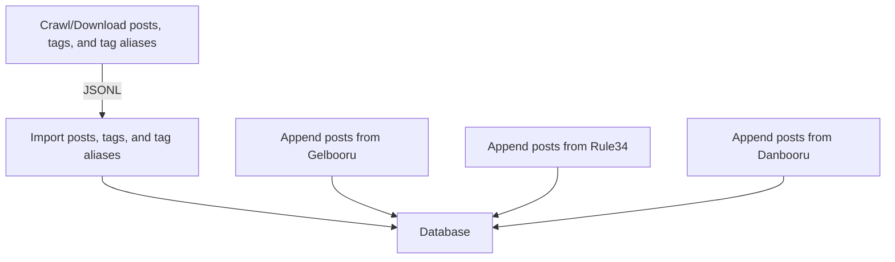
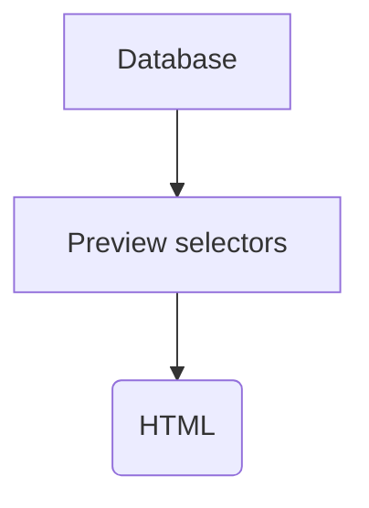
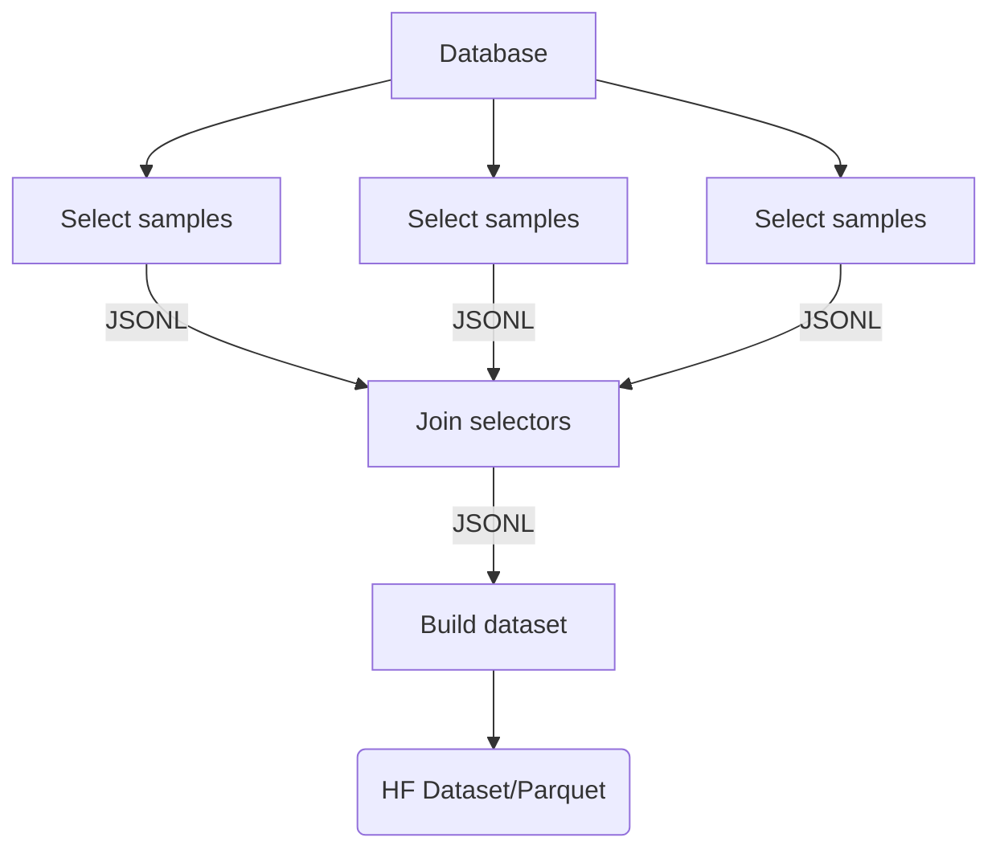
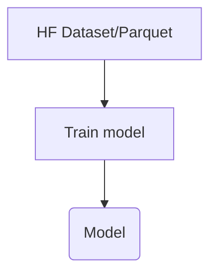

# E621 Rising Dataset Build and Training Configuration

> Build and training configuration for Stable Diffusion XL model [e621-rising-v3](https://huggingface.co/hearmeneigh/e621-rising-v3)

This repository lets you:
* Crawl E621 for posts and tags
* Build a dataset from the crawled data
* Download images
* Train a Stable Diffusion 1.x, 2.x, or XL model
* Publish trained model on Huggingface, S3
* Convert model to Stable Diffusion WebUI compatible version

This configuration uses the [Dataset Rising](https://github.com/hearmeneigh/dataset-rising) toolchain.

## Requirements
* Python `>=3.8`
* Docker `>=22.0.0`


## Setting Up
```bash
cd <e621-rising-configs-root>
python3 -m venv ./venv
pip3 install -r requirements.txt

# Activate Python VENV:
source ./venv/bin/activate
```

## Shutting Down
```bash
# Stop MongoDB Docker container
dr-db-down

# Remove Docker image (warning: this will delete all data)
dr-db-uninstall
```

## Quickstart
If you are interested in creating a new dataset from E621 data, you don't need to start from scratch. 
You can use a prebuilt [Docker image](https://github.com/hearmeneigh/e621-rising-configs/pkgs/container/e621-rising-configs), saving hours of crawling and processing time.

The Docker image:
* Preloaded with E621 tag, tag alias, and post metadata as they were on `2023-09-21`
* Based on MongoDB 6.x
  * Username: `root`
  * Password: `root`
  * Database: `dataset_rising`
  * URL: `localhost:27017`
* Native `x86_64` and `arm64` builds

```bash
# make sure you stop and remove any previous Dataset Rising instances first:
# dr-db-down && dr-db-uninstall

# start preloaded Docker image
docker run --name dataset-rising-mongo --restart always -p '27017:27017' -d ghcr.io/hearmeneigh/e621-rising-configs:latest 
```

Alternatively, you can download the JSONL files produced by the crawling steps 1–3 from here:

[`e621-tags.jsonl.xz`](https://huggingface.co/datasets/hearmeneigh/e621-rising-v3-preliminary-data/resolve/main/e621-tags.jsonl.xz)
[`e621-posts.jsonl.xz`](https://huggingface.co/datasets/hearmeneigh/e621-rising-v3-preliminary-data/resolve/main/e621-posts.jsonl.xz)
[`e621-aliases.jsonl.xz`](https://huggingface.co/datasets/hearmeneigh/e621-rising-v3-preliminary-data/resolve/main/e621-aliases.jsonl.xz)

## Crawling and Importing Data


First you will need to download E621 tag and post metadata and import it into the Dataset Rising database.
No images will be downloaded during these steps.

> ### Note!
> These steps will download a lot of metadata from E621. This will take a while and strain their poor servers.
>
> Consider using [prebuilt data](#quickstart) instead.
> 
> If you are using the prebuilt Docker image, skip to [Testing the Selectors](#testing-the-selectors)

```bash
cd <e621-rising-configs-root>
source ./venv/bin/activate  # you only need to run 'activate' once per session
dr-db-up

export BASE_PATH="/workspace"

# change this:
export AGENT_STRING='<AGENT_STRING>'


## 1. download tag metadata
dr-crawl --output "${BASE_PATH}/downloads/e621.net/e621-tags.jsonl" \
  --type tags \
  --source e621 \
  --recover \
  --agent "${AGENT_STRING}"


## 2. download tag alias metadata
dr-crawl --output "${BASE_PATH}/downloads/e621.net/e621-aliases.jsonl" \
  --type aliases \
  --source e621 \
  --recover \
  --agent "${AGENT_STRING}"


## 3. download post metadata
dr-crawl --output "${BASE_PATH}/downloads/e621.net/e621-posts.jsonl" \
  --type posts \
  --source e621 \
  --recover \
  --agent "${AGENT_STRING}"


## 4. import metadata into the database
dr-import --tags "${BASE_PATH}/downloads/e621.net/e621-tags.jsonl" \
  --posts "${BASE_PATH}/downloads/e621.net/e621-posts.jsonl" \
  --aliases "${BASE_PATH}/downloads/e621.net/e621-aliases.jsonl" \
  --source e621 \
  --tag-version v2 \
  --prefilter ./tag_normalizer/prefilter.yaml \
  --rewrites ./tag_normalizer/rewrites.yaml \
  --aspect-ratios ./tag_normalizer/aspect_ratios.yaml \
  --category-weights ./tag_normalizer/category_weights.yaml \
  --symbols ./tag_normalizer/symbols.yaml \
  --remove-old
```

### Appending Data from Other Sources
This is an optional step, in case you wish to mix data from multiple sources.

```bash
cd <e621-rising-configs-root>/extras

# generate a list of post IDs to download; stored in BUILD_PATH
./extras.sh

# register new tags (e.g. artists who are not on E621)
# see more detailed example in ./devops/docker/import.sh:append_artists()
dr-add-tag \
  --tag "some_artist" \
  --source "gelbooru" \
  --category "artist" \
  --category-weights ./tag_normalizer/category_weights.yaml \
  --skip-if-exists 

# import additional posts
dr-append \
  --source "rule34" \
  --posts "${BUILD_PATH}/downloads/rule34.jsonl"

dr-append \
  --source "gelbooru" \
  --posts "${BUILD_PATH}/downloads/gelbooru.jsonl"

dr-append \
  --source "danbooru" \
  --posts "${BUILD_PATH}/downloads/danbooru.jsonl"
```


## Testing the Selectors



Instead of feeding all possible images to the model, we prefer to select a subset of images that are
likely to be high quality samples for the model to learn from. This is done by writing one or more selectors,
which are YAML files that describe the criteria for selecting images.

E621 Rising uses five selectors:

* [`select/tier-1/tier-1.yaml`](./select/tier-1/tier-1.yaml)
* [`select/tier-2/tier-2.yaml`](./select/tier-2/tier-2.yaml)
* [`select/tier-3/tier-3.yaml`](./select/tier-3/tier-3.yaml)
* [`select/tier-4/tier-4.yaml`](./select/tier-4/tier-4.yaml)
* [`select/extras/extras.yaml`](./select/extras/extras.yaml) (optional images from other sources)

You can preview the selectors by running the following commands:

```bash
cd <e621-rising-configs-root>
source ./venv/bin/activate  # you only need to run 'activate' once per session
dr-db-up

export BASE_PATH="/workspace"
export BUILD_PATH="${BASE_PATH}/build"

# category selector preview (artists):
dr-preview --selector ./select/tier-1/helpers/artists.yaml \
  --output "${BUILD_PATH}/preview/tier-1-artists" \
  --output-format html \
  --template ./preview/preview.html.jinja \
  --limit 10
  
# selector preview:
dr-preview --selector ./select/tier-1/tier-1.yaml \
  --aggregate \
  --output "${BUILD_PATH}/preview/tier-1" \
  --output-format html \
  --template ./preview/preview.html.jinja

dr-preview --selector ./select/tier-2/tier-2.yaml \
  --aggregate \
  --output "${BUILD_PATH}/preview/tier-2" \
  --output-format html \
  --template ./preview/preview.html.jinja

dr-preview --selector ./select/tier-3/tier-3.yaml \
  --aggregate \
  --output "${BUILD_PATH}/preview/tier-3" \
  --output-format html \
  --template ./preview/preview.html.jinja

dr-preview --selector ./select/tier-4/tier-4.yaml \
  --aggregate \
  --output "${BUILD_PATH}/preview/tier-4" \
  --output-format html \
  --template ./preview/preview.html.jinja

dr-preview --selector ./select/extras/extras.yaml \
  --aggregate \
  --output "${BUILD_PATH}/preview/extras" \
  --output-format html \
  --template ./preview/preview.html.jinja


# gap analysis (e.g. see which artists are missing from the selectors):
dr-gap --selector ./select/tier-1/tier-1.yaml \
  --selector ./select/tier-2/tier-2.yaml \
  --selector ./select/tier-3/tier-3.yaml \
  --selector ./select/tier-4/tier-4.yaml \
  --selector ./select/extras/extras.yaml \
  --category artists \
  --output "${BUILD_PATH}/preview/gap" \
  --output-format html \
  --template ./preview/preview.html.jinja
```


## Creating a Dataset



When you are satisfied with the selectors, create a dataset from them.

The `dr-join` scripts takes the selected samples as an input and joins them together,
pruning duplicates and balancing the selected samples in the process.

The `dr-build` script takes the joined samples as an input, downloads the images, and
builds a dataset from them. 

```bash
cd <e621-rising-configs-root>
source ./venv/bin/activate  # you only need to run 'activate' once per session
dr-db-up

export BASE_PATH="/workspace"
export BUILD_PATH="${BASE_PATH}/build"
export DATASET_IMAGE_HEIGHT=1024
export DATASET_IMAGE_WIDTH=1024

# change these:
export HUGGINGFACE_DATASET_NAME="hearmeneigh/e621-rising-v3-curated"
export S3_DATASET_URL="s3://e621-rising/v3/dataset/curated"
export AGENT_STRING='<AGENT_STRING>'


## select samples for the dataset
dr-select --selector ./select/tier-1/tier-1.yaml \
  --output "${BUILD_PATH}/samples/tier-1.jsonl" \
  --image-format jpg \
  --image-format png

dr-select --selector ./select/tier-2/tier-2.yaml \
  --output "${BUILD_PATH}/samples/tier-2.jsonl" \
  --image-format jpg \
  --image-format png

dr-select --selector ./select/tier-3/tier-3.yaml \
  --output "${BUILD_PATH}/samples/tier-3.jsonl" \
  --image-format jpg \
  --image-format png

dr-select --selector ./select/tier-4/tier-4.yaml \
  --output "${BUILD_PATH}/samples/tier-4.jsonl" \
  --image-format jpg \
  --image-format png

dr-select --selector ./select/extras/extras.yaml \
  --output "${BUILD_PATH}/samples/extras.jsonl" \
  --image-format jpg \
  --image-format png


## join selected samples into a single JSONL file
dr-join --samples "${BUILD_PATH}/samples/tier-1.jsonl:*" \
  --samples "${BUILD_PATH}/samples/extras.jsonl:*" \
  --samples "${BUILD_PATH}/samples/tier-2.jsonl:48%" \
  --samples "${BUILD_PATH}/samples/tier-3.jsonl:18%" \
  --samples "${BUILD_PATH}/samples/tier-4.jsonl:6%" \
  --output "${BUILD_PATH}/dataset/samples.jsonl" \
  --export-tags "${BUILD_PATH}/dataset/tag-counts.json" \
  --export-autocomplete "${BUILD_PATH}/dataset/webui-autocomplete.csv" \
  --min-posts-per-tag 100 \
  --min-tags-per-post 15 \
  --prefilter ./dataset/prefilter.yaml
  
## build the dataset and download the images
## (all images are stored as JPEGs with 95% quality)
dr-build --samples "${BUILD_PATH}/dataset/samples.jsonl" \
  --agent "${AGENT_STRING}" \
  --output "${BUILD_PATH}/dataset/data" \
  --image-width "${DATASET_IMAGE_WIDTH}" \
  --image-height "${DATASET_IMAGE_HEIGHT}" \
  --image-format jpg \
  --image-quality 95 \
  --num-proc $(nproc) \
  --separator ' '
```


## Uploading Model to Huggingface
After building your dataset, [upload it to Huggingface](https://huggingface.co/docs/hub/models-uploading).


## Training a Model


When training a Stable Diffusion XL model, can train **two** models: [`stabilityai/stable-diffusion-xl-base-1.0`](https://huggingface.co/stabilityai/stable-diffusion-xl-base-1.0) and [`stabilityai/stable-diffusion-xl-refiner-1.0`](https://huggingface.co/stabilityai/stable-diffusion-xl-refiner-1.0).
(If unsure what to do, start with the base model.)

Note that this training step assumes that you have already uploaded your dataset to Huggingface.

```bash
cd <e621-rising-configs-root>
source ./venv/bin/activate  # you only need to run 'activate' once per session

export DATASET="hearmeneigh/e621-rising-v3-curated"  # dataset to train on
export BASE_MODEL="stabilityai/stable-diffusion-xl-base-1.0"  # model to start from
export BASE_PATH="/workspace"

export MODEL_NAME="hearmeneigh/e621-rising-v3"  # Huggingface name of the model we're training/finetuning from
export MODEL_IMAGE_RESOLUTION=1024
export EPOCHS=10
export BATCH_SIZE=1  # batch size should be as high as possible;
                     # it will require a lot of GPU memory, though
export PRECISION=no  # no, bf16, or fp16 depending on your GPU; use 'no' if unsure


# train the model
# Note! This will not be an accelerated training run -- see below
# for instructions on how to use Accelerate to train with multiple GPUs
dr-train-xl \
  --pretrained-model-name-or-path "${BASE_MODEL}" \
  --dataset-name "${DATASET}" \
  --output-dir "${BASE_PATH}/model/${MODEL_NAME}" \
  --cache-path "${BASE_PATH}/cache/model/${MODEL_NAME}" \
  --resolution "${MODEL_IMAGE_RESOLUTION}" \
  --maintain-aspec-ratio \
  --reshuffle-tags \
  --tag-separator ' ' \
  --center-crop \
  --random-flip \
  --train-batch-size "${BATCH_SIZE}" \
  --learning-rate 4e-6 \
  --use-ema \
  --max-grad-norm 1.0 \
  --checkpointing-steps 5000 \
  --lr-scheduler constant \
  --lr-warmup-steps 0 \
  --mixed-precision "${PRECISION}" \
  --resume-from-checkpoint "latest" \
  --dataloader-num-workers $(nproc)
  # optional:
  # --enable-xformers-memory-efficient-attention


# convert the model to safetensors -- this version can be used with Stable Diffusion WebUI
dr-convert-sdxl \
  --model_path "${BASE_PATH}/model/${MODEL_NAME}" \
  --checkpoint_path "${BASE_PATH}/model/${MODEL_NAME}.safetensors" \
  --use_safetensors
```

## Training with Accelerate and Multiple GPUs

See [`./util/trainer.sh`](./util/trainer.sh) for a script that can be used to train with multiple GPUs.

```bash
cd <e621-rising-configs-root>
source ./venv/bin/activate  # you only need to run 'activate' once per session

export DATASET="hearmeneigh/e621-rising-v3-curated"  # dataset to train on
export BASE_MODEL="stabilityai/stable-diffusion-xl-base-1.0"  # model to start from
export BASE_PATH="/workspace"

export MODEL_NAME="hearmeneigh/e621-rising-v3"  # Huggingface name of the model we're training/finetuning from
export MODEL_IMAGE_RESOLUTION=1024
export EPOCHS=10
export BATCH_SIZE=1  # batch size should be as high as possible;
                     # it will require a lot of GPU memory, though
export PRECISION=no  # no, bf16, or fp16 depending on your GPU; use 'no' if unsure

accelerate launch --multi_gpu --mixed_precision=${PRECISION} ./venv/lib/python3.11/site-packages/train/dr_train.py \
  --pretrained-model-name-or-path "${BASE_MODEL}" \
  --dataset-name "${DATASET}" \
  --output-dir "${BASE_PATH}/model/${MODEL_NAME}" \
  --cache-path "${BASE_PATH}/cache/model/${MODEL_NAME}" \
  --resolution "${MODEL_IMAGE_RESOLUTION}" \
  --maintain-aspec-ratio \
  --reshuffle-tags \
  --tag-separator ' ' \
  --center-crop \
  --random-flip \
  --train-batch-size "${BATCH_SIZE}" \
  --learning-rate 4e-6 \
  --use-ema \
  --max-grad-norm 1.0 \
  --checkpointing-steps 5000 \
  --lr-scheduler constant \
  --lr-warmup-steps 0 \
  --mixed-precision "${PRECISION}" \
  --dataloader-num-workers $(nproc)
```

## Developers

### Multiplatform Build

#### Local Machine
```bash
docker login ghcr.io

cd <e621-rising-configs>/devops/docker
docker buildx create --name dataset-rising-builder --bootstrap --config ./buildkit.toml --driver-opt env.BUILDKIT_STEP_LOG_MAX_SIZE=1000000000
docker buildx build --push --platform linux/x86_64,linux/arm64 --builder dataset-rising-builder --tag ghcr.io/hearmeneigh/e621-rising-configs:latest .
```


#### EKS / Kubernetes

```bash
curl -O https://s3.us-west-2.amazonaws.com/amazon-eks/1.28.1/2023-09-14/bin/linux/amd64/kubectl
curl -O https://s3.us-west-2.amazonaws.com/amazon-eks/1.28.1/2023-09-14/bin/linux/arm64/kubectl
chmod +x ./kubectl
sudo mv ./kubectl /usr/local/bin/kubectl

aws configure 
aws eks update-kubeconfig --region REGION --name CLUSTER_NAME

docker login ghcr.io

docker -D buildx create --bootstrap --name dataset-rising-builder-k8 --driver kubernetes --platform=linux/arm64 --node=NODE_GROUP_NAME --driver-opt=nodeselector="kubernetes.io/arch=arm64"
docker -D buildx create --append --bootstrap --name dataset-rising-builder-k8 --driver kubernetes --platform=linux/amd64 --node=NODE_GROUP_NAME --driver-opt=nodeselector="kubernetes.io/arch=amd64"

docker buildx build --push --platform linux/x86_64,linux/arm64 --builder dataset-rising-builder-k8 --tag ghcr.io/hearmeneigh/e621-rising-configs:latest .
```
