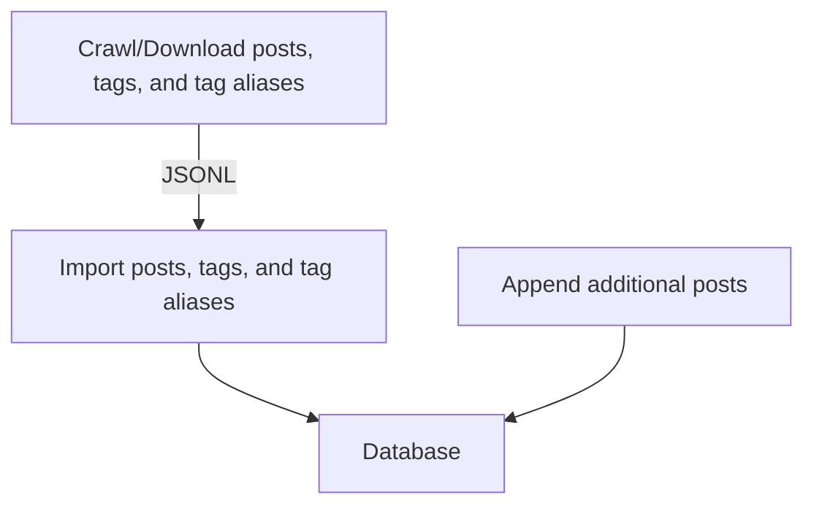
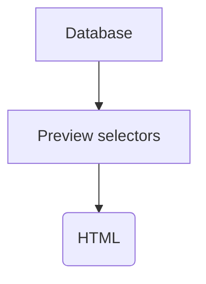
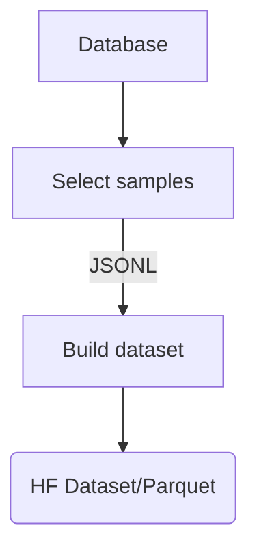
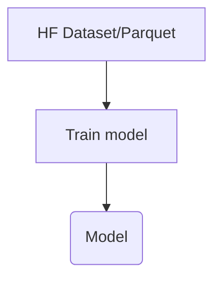

# E621 Rising Dataset Build and Training Configuration

> Build and training configuration for Stable Diffusion XL model [e621-rising-v3](https://huggingface.co/hearmeneigh/e621-rising-v3)

This repository lets you:
* Crawl E621 for posts and tags
* Build a dataset from the crawled data
* Download images
* Train a Stable Diffusion 1.x, 2.x, or XL model
* Publish trained model on Huggingface, S3
* Convert model to Stable Diffusion WebUI compatible version

This configuration uses the [Dataset Rising](https://github.com/hearmeneigh/dataset-rising) toolchain.

## Requirements
* Python `>=3.8`
* Docker `>=22.0.0`


## Setting Up
```bash
cd <e621-rising-configs-root>
python3 -m venv ./venv
pip3 install -r requirements.txt

# Activate Python VENV:
source ./venv/bin/activate

# Start and set up MongoDB Docker container (user: root, pass: root)
dr-db-up
```

## Shutting Down
```bash
# Stop MongoDB Docker container
dr-db-down

# Remove Docker image (warning: this will delete all data)
dr-db-uninstall
```

## Quickstart
If you are interested in creating a new dataset from E621 data, you don't need to start from scratch. 
You can use a prebuilt [Docker image](https://github.com/hearmeneigh/e621-rising-configs/pkgs/container/e621-rising-configs), saving hours of crawling and processing time.

The Docker image:
* Preloaded with E621 tag, tag alias, and post metadata as they were on `2023-09-21`
* Based on MongoDB 6.x
  * Username: `root`
  * Password: `root`
  * Database: `dataset_rising`
  * URL: `localhost:27017`
* Native `x86_64` and `arm64` builds

```bash
docker run --name dataset-rising-mongo --restart always -p '27017:27017' -d ghcr.io/hearmeneigh/e621-rising-configs:latest 
```

Alternatively, you can download the JSONL files produced by the crawling steps 1–3 from here:

[`e621-tags.jsonl.xz`](https://huggingface.co/datasets/hearmeneigh/e621-rising-v3-preliminary-data/resolve/main/e621-tags.jsonl.xz)
[`e621-posts.jsonl.xz`](https://huggingface.co/datasets/hearmeneigh/e621-rising-v3-preliminary-data/resolve/main/e621-posts.jsonl.xz)
[`e621-aliases.jsonl.xz`](https://huggingface.co/datasets/hearmeneigh/e621-rising-v3-preliminary-data/resolve/main/e621-aliases.jsonl.xz)

## Crawling and Importing Data


Download E621 tag and post metadata and import it into the Dataset Rising database.
No images will be downloaded in these steps.

> ### Note!
> These steps will download a lot of metadata from E621. This will take a while and strain their poor servers.
>
> Consider using [prebuilt data](#quickstart) instead.
> 
> If you are using the prebuilt Docker image, skip to [Testing the Selectors](#testing-the-selectors)

```bash
cd <e621-rising-configs-root>
source ./venv/bin/activate  # you only need to run 'activate' once per session
dr-db-up

export BASE_PATH="/workspace"

# change this:
export AGENT_STRING='<AGENT_STRING>'


## 1. download tag metadata
dr-crawl --output "${BASE_PATH}/downloads/e621.net/e621-tags.jsonl" \
  --type tags \
  --source e621 \
  --recover \
  --agent "${AGENT_STRING}"


## 2. download tag alias metadata
dr-crawl --output "${BASE_PATH}/downloads/e621.net/e621-aliases.jsonl" \
  --type aliases \
  --source e621 \
  --recover \
  --agent "${AGENT_STRING}"


## 3. download post metadata
dr-crawl --output "${BASE_PATH}/downloads/e621.net/e621-posts.jsonl" \
  --type posts \
  --source e621 \
  --recover \
  --agent "${AGENT_STRING}"


## 4. import metadata into the database
dr-import --tags "${BASE_PATH}/downloads/e621.net/e621-tags.jsonl" \
  --posts "${BASE_PATH}/downloads/e621.net/e621-posts.jsonl" \
  --aliases "${BASE_PATH}/downloads/e621.net/e621-aliases.jsonl" \
  --source e621 \
  --tag-version v2 \
  --prefilter ./tag_normalizer/prefilter.yaml \
  --rewrites ./tag_normalizer/rewrites.yaml \
  --aspect-ratios ./tag_normalizer/aspect_ratios.yaml \
  --category-weights ./tag_normalizer/category_weights.yaml \
  --symbols ./tag_normalizer/symbols.yaml \
  --remove-old
```


## Testing the Selectors



Instead of feeding all possible images to the model, we prefer to select a subset of images that are
likely to be high quality samples for the model to learn from. This is done by writing one or more selectors,
which are YAML files that describe the criteria for selecting images.

E621 Rising uses four selectors:

[`select/curated.yaml`](./select/curated.yaml)
[`select/positive.yaml`](./select/positive.yaml)
[`select/negative.yaml`](./select/negative.yaml)
[`select/uncurated.yaml`](./select/uncurated.yaml)

You can preview the selectors by running the following commands:

```bash
cd <e621-rising-configs-root>
source ./venv/bin/activate  # you only need to run 'activate' once per session
dr-db-up

export BASE_PATH="/workspace"
export BUILD_PATH="${BASE_PATH}/build"

# category selector preview (artists):
dr-preview --selector ./select/positive/artists.yaml \
  --output "${BUILD_PATH}/preview/positive-artists" \
  --output-format html \
  --template ./preview/preview.html.jinja
  
# selector preview:
dr-preview --selector ./select/positive.yaml \
  --aggregate \
  --output "${BUILD_PATH}/preview/positive" \
  --output-format html \
  --template ./preview/preview.html.jinja

dr-preview --selector ./select/negative.yaml \
  --aggregate \
  --output "${BUILD_PATH}/preview/negative" \
  --output-format html \
  --template ./preview/preview.html.jinja

# gap analysis (e.g. see which artists are missing from the selectors):
dr-gap --selector ./select/curated.yaml \
  --selector ./select/positive.yaml \
  --selector ./select/negative.yaml \
  --selector ./select/uncurated.yaml \
  --category artists \
  --output "${BUILD_PATH}/preview/gap" \
  --output-format html \
  --template ./preview/preview.html.jinja
```


## Creating a Dataset



When you are satisfied with the selectors, create a dataset from them. The `dr-build` script takes the selected 
samples as an input, downloads the images, and builds a dataset from them. 

```bash
cd <e621-rising-configs-root>
source ./venv/bin/activate  # you only need to run 'activate' once per session
dr-db-up

export BASE_PATH="/workspace"
export BUILD_PATH="${BASE_PATH}/build"
export DATASET_IMAGE_HEIGHT=4096
export DATASET_IMAGE_WIDTH=4096

# change these:
export HUGGINGFACE_DATASET_NAME="hearmeneigh/e621-rising-v3-curated"
export S3_DATASET_URL="s3://e621-rising/v3/dataset/curated"
export AGENT_STRING='<AGENT_STRING>'


## select samples for the dataset
dr-select --selector ./select/curated.yaml \
  --output "${BUILD_PATH}/samples/curated.jsonl" \
  --image-format jpg \
  --image-format png

dr-select --selector ./select/positive.yaml \
  --output "${BUILD_PATH}/samples/positive.jsonl" \
  --image-format jpg \
  --image-format png

dr-select --selector ./select/negative.yaml \
  --output "${BUILD_PATH}/samples/negative.jsonl" \
  --image-format jpg \
  --image-format png

dr-select --selector ./select/uncurated.yaml \
  --output "${BUILD_PATH}/samples/uncurated.jsonl" \
  --image-format jpg \
  --image-format png


## build the dataset, download the images, and upload to S3 and Huggingface
## (all images are stored as JPEGs with 85% quality)
dr-build --samples "${BUILD_PATH}/samples/curated.jsonl:40%" \
  --samples "${BUILD_PATH}/samples/positive.jsonl:30%" \
  --samples "${BUILD_PATH}/samples/negative.jsonl:20%" \
  --samples "${BUILD_PATH}/samples/uncurated.jsonl:10%" \
  --agent "${AGENT_STRING}" \
  --output "${BUILD_PATH}/dataset/data" \
  --export-tags "${BUILD_PATH}/dataset/tag-counts.json" \
  --export-autocomplete "${BUILD_PATH}/dataset/webui-autocomplete.csv" \
  --min-posts-per-tag 150 \
  --min-tags-per-post 15 \
  --prefilter ./dataset/prefilter.yaml \
  --image-width "${DATASET_IMAGE_WIDTH}" \
  --image-height "${DATASET_IMAGE_HEIGHT}" \
  --image-format jpg \
  --image-quality 85 \
  --num-proc $(nproc) \
  --upload-to-hf "${HUGGINGFACE_DATASET_NAME}" \
  --upload-to-s3 "${S3_DATASET_URL}" \
  --separator ' '
```


## Training a Model



When training a Stable Diffusion XL model, can train **two** models: [`stabilityai/stable-diffusion-xl-base-1.0`](https://huggingface.co/stabilityai/stable-diffusion-xl-base-1.0) and [`stabilityai/stable-diffusion-xl-refiner-1.0`](https://huggingface.co/stabilityai/stable-diffusion-xl-refiner-1.0).
(If unsure what to do, start with the base model.)

```bash
cd <e621-rising-configs-root>
source ./venv/bin/activate  # you only need to run 'activate' once per session

export DATASET="hearmeneigh/e621-rising-v3-curated"  # dataset to train on
export BASE_MODEL="stabilityai/stable-diffusion-xl-base-1.0"  # model to start from
export BASE_PATH="/workspace"

export MODEL_NAME="hearmeneigh/e621-rising-v3"  # Huggingface name of the model we're building
export MODEL_IMAGE_RESOLUTION=1024
export EPOCHS=10
export BATCH_SIZE=1  # in real training, batch size should be as high as possible;
                     # it will require a lot of GPU memory
export PRECISION=no  # no, bf16, or fp16 depending on your GPU; use 'no' if unsure


# train the model
dr-train --pretrained-model-name-or-path "${BASE_MODEL}" \
  --dataset-name "${DATASET}" \
  --output-dir "${BASE_PATH}/model/${MODEL_NAME}" \
  --cache-path "${BASE_PATH}/cache/model/${MODEL_NAME}" \
  --resolution "${MODEL_IMAGE_RESOLUTION}" \
  --maintain-aspec-ratio \
  --reshuffle-tags \
  --tag-separator ' ' \
  --center-crop \
  --random-flip \
  --train-batch-size "${BATCH_SIZE}" \
  --learning-rate 4e-6 \
  --use-ema \
  --max-grad-norm 1.0 \
  --checkpointing-steps 5000 \
  --lr-scheduler constant \
  --lr-warmup-steps 0 \
  --mixed-precision "${PRECISION}" \
  --resume-from-checkpoint "latest" \
  --dataloader-num-workers $(nproc)
  # optional:
  # --enable-xformers-memory-efficient-attention


# upload the model to Huggingface
dr-upload-hf --model-path "${BASE_PATH}/model/${MODEL_NAME}" --hf-model-name "${MODEL_NAME}"


# convert the model to safetensors -- this version can be used with Stable Diffusion WebUI
dr-convert-sdxl \
  --model_path "${BASE_PATH}/model/${MODEL_NAME}" \
  --checkpoint_path "${BASE_PATH}/model/${MODEL_NAME}.safetensors" \
  --use_safetensors
```


## Developers

### Multiplatform Build

#### Local Machine
```bash
docker login ghcr.io

cd <e621-rising-configs>/devops/docker
docker buildx create --name dataset-rising-builder --bootstrap --config ./buildkitd.toml --driver-opt env.BUILDKIT_STEP_LOG_MAX_SIZE=1000000000
docker buildx build --push --platform linux/x86_64,linux/arm64 --builder dataset-rising-builder --tag ghcr.io/hearmeneigh/e621-rising-configs:latest .
```


#### Kubernetes
(Incomplete)

```bash
sudo apt-get install -y apt-transport-https ca-certificates curl
curl -fsSL https://pkgs.k8s.io/core:/stable:/v1.28/deb/Release.key | sudo gpg --dearmor -o /etc/apt/keyrings/kubernetes-apt-keyring.gpg
echo 'deb [signed-by=/etc/apt/keyrings/kubernetes-apt-keyring.gpg] https://pkgs.k8s.io/core:/stable:/v1.28/deb/ /' | sudo tee /etc/apt/sources.list.d/kubernetes.list
sudo apt-get update
sudo apt-get install -y kubectl

aws configure 
aws eks update-kubeconfig --region REGION --name CLUSTER_NAME

# kubectl namespace create dataset-rising-builder

docker login ghcr.io
docker -D buildx create --bootstrap --name dataset-rising-builder-k8 --driver kubernetes

docker buildx build --push --platform linux/x86_64,linux/arm64 --builder dataset-rising-builder-k8 --tag ghcr.io/hearmeneigh/e621-rising-configs:latest .
```
